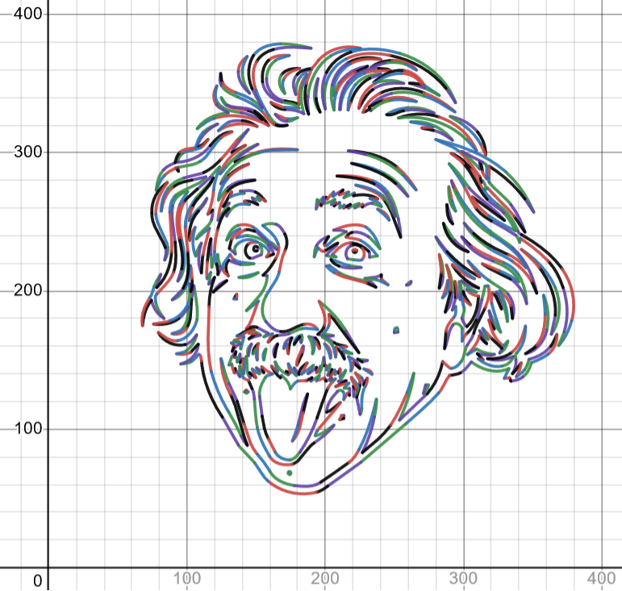

# svg_to_latex

The utility allows you to convert an __svg__ file with a simple vector image into a set of LaTex format formulas. Next they could be used for example in Demos.

### What it can
Supported figure types:
- line 
- rect
- circle
- ellipse

Alsr svg __path__ turns into set of polynomials of 1st, 2nd and 3rd degrees 

`Note: sometimes rect works incorrectly`

### How to use
1. Set up __filename__ and __precision__ in .py file. It's a name of .svg file `(like 'aesc.svg')` and number of decimal places in result formulas
2. Add needed figures to the __types[]__ (it's better not to use 'rect')
3. Place `.svg` file to the folder with svg_to_latex.py
3. Run the script with __python svg_to_latex.py__

Result formulas will appear in __result.txt__

### How to color in Desmos
File __desmos_console_commands.js__ contains three different scripts for browser console.

#### PAINT ALL ONE COLOR
Paints all in one color

#### PAINT WITH colors_array
Paints with same colors that in `.svg` file. May need to add some alias-named colors to __colors[]__ in __svg_to_latex.py__. Copy __colors_array[]__ from __coloring.txt__ to the script and then use it

#### RAINBOW COLORING
Colors formulas consistently with changing hue in hsla format

### Example
original svg picture / output of the script drawn using desmos

  
  

